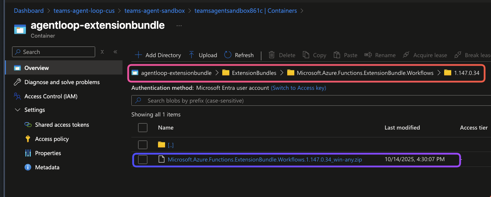
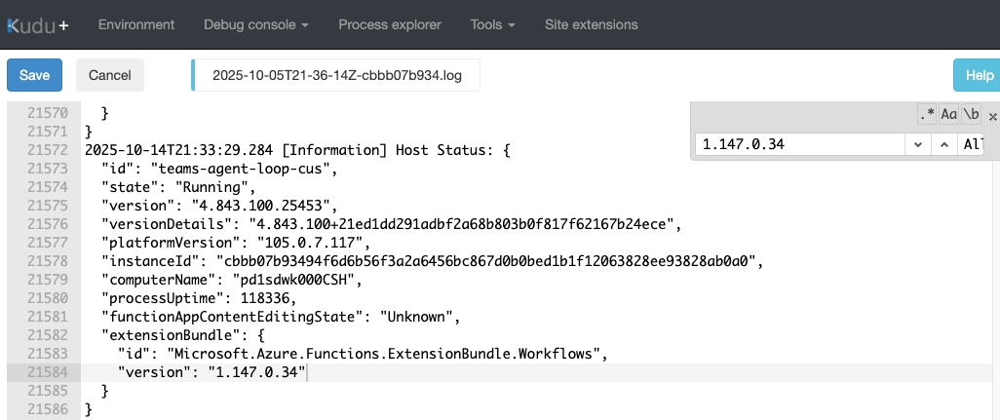

# Azure Logic Apps Easy Auth Configuration for Okta Web Application

## Overview
This guide provides step-by-step instructions for configuring Azure Logic Apps Easy Authentication with Okta as the identity provider.

## Prerequisites
- Azure subscription with Logic Apps resource
- Okta developer account or admin access
- Basic understanding of OAuth 2.0 and OpenID Connect

## Okta Application Identity Configuration

### Creating the Okta Web Application

1. **Sign in to Okta Admin Portal**
   - Navigate to your Okta admin portal
   - Go to Applications > Applications

2. **Create New App Integration**
   - Click "Create App Integration"
   - Select **OIDC - OpenID Connect** as the sign-in method
   - Choose **Web Application** as the application type
   - Click "Next"

3. **Configure Application Settings**
   - **App integration name**: Choose a descriptive name (e.g., "teams-a2a-auth-app")
   - **Grant type**: Select "Authorization Code" and "Refresh Token"
   - **Sign-in redirect URIs**: Add your application's callback URL

     ```text
     https://<your-logic-app>.azurewebsites.net/.auth/login/okta1test/callback
     https://token.botframework.com/.auth/web/redirect
     ```

   - **Sign-out redirect URIs**: (Optional) Add post-logout redirect URLs
   - **Controlled access**: Choose appropriate assignment (e.g., "Allow everyone in your organization to access")

4. **Save the Application**
   - Click "Save" to create the application
   - Note down the **Client ID** and **Client Secret** from the "Client Credentials" section

### Configuring OAuth Settings

1. **Grant Types Configuration**
   - Ensure "Authorization Code" is enabled for user authentication flows
   - Enable "Client Credentials" for service-to-service authentication (if needed)
   - Enable "Refresh Token" for token renewal

2. **Token Endpoint Authentication Method**
   - Default is `client_secret_basic` (recommended)
   - Alternative options: `client_secret_post`, `client_secret_jwt`, `private_key_jwt`

3. **Scopes Configuration**
   - **Standard scopes**: `openid`, `profile`, `email`
   - **Additional scopes**: `offline_access` (for refresh tokens)
   - **Custom scopes**: Add any application-specific scopes as needed

### Setting Up Redirect URIs

1. **Azure Logic Apps Redirect URI**

   ```text
    https://<your-logic-app>.azurewebsites.net/.auth/login/okta1test/callback
   ```

2. **Bot Framework Token Service URI** (if using with bots)

   ```text
   https://token.botframework.com/.auth/web/redirect
   ```

3. **Local Development URIs** (for testing)

   ```text
   http://localhost:3978/.auth/login/aad/callback
   https://localhost:7071/.auth/login/aad/callback
   ```

### Obtaining Client Credentials

1. **Navigate to Your Application**
   - In Okta Admin Portal, go to Applications > Applications
   - Click on your created application

2. **Access Client Credentials**
   - In the "General" tab, scroll to "Client Credentials" section
   - Copy the **Client ID** (this will be public)
   - Copy the **Client Secret** (keep this secure)

3. **Authorization Server Details**
   - Navigate to Security > API > Authorization Servers
   - Note the **Issuer URI** for your authorization server (usually the default)
   - Example: `https://your-okta-domain.okta.com/oauth2/default`

4. **Endpoint URLs** (derived from Issuer URI)
   - **Authorization URL**: `https://your-okta-domain.okta.com/oauth2/v1/authorize`
   - **Token URL**: `https://your-okta-domain.okta.com/oauth2/v1/token`
   - **Refresh URL**: `https://your-okta-domain.okta.com/oauth2/v1/token`
   - **JWKS URI**: `https://your-okta-domain.okta.com/oauth2/v1/keys`
   - **Userinfo URL**: `https://your-okta-domain.okta.com/oauth2/v1/userinfo`

## Azure Logic Apps Easy Auth Configuration

### Uploading Functions Private Bundle for Okta v1 Token Support

Azure Logic Apps Easy Auth requires a specific Functions Private Bundle to properly handle Okta's v1 OAuth tokens. This step is crucial for compatibility with Okta's default authorization server.

#### Bundle Prerequisites

- Access to the Azure Storage Account associated with your Logic App
- The artifacts from the `artifacts/` folder in this repository
- Azure Storage Explorer or access to Azure Portal

#### Step 1: Locate Your Logic App's Storage Account

1. **Navigate to your Logic App** in the Azure Portal
2. **Go to Settings > Configuration**
3. **Find the `AzureWebJobsStorage` setting** - this contains your storage account connection string
4. **Note the storage account name** from the connection string

#### Step 2: Access Azure Storage

1. **Open Azure Storage Explorer** or navigate to your storage account in the Azure Portal
2. **Connect to your storage account** using the connection string or account credentials
3. **Navigate to the Blob Containers**

#### Step 3: Create the Directory Structure

Create the following directory structure in your storage account:

```text
ExtensionsBundles/
└── Microsoft.Azure.Functions.ExtensionBundle.Workflows/
    └── 1.147.0.34/
```

**Important**: Ensure you create the `1.147.0.34` directory first before uploading any files.

#### Step 4: Upload the Bundle Files

Upload the following files from the `artifacts/` folder to the `1.147.0.34` directory:

1. **`index.json`** - Contains the bundle version index
2. **`dependency.json`** - Contains dependency information  
3. **`Microsoft.Azure.Functions.ExtensionBundle.Workflows.1.147.0.34.zip`** - The main bundle package


#### Step 5: Verify Upload

After uploading, your storage structure should look like:

```text
ExtensionsBundles/
└── Microsoft.Azure.Functions.ExtensionBundle.Workflows/
    ├── index.json
    ├── dependency.json
    └── 1.147.0.34/
        └── Microsoft.Azure.Functions.ExtensionBundle.Workflows.1.147.0.34.zip
```



#### Step 5: Configure Environment Variables

Before restarting the Logic App, you need to configure environment variables to point to the uploaded bundle:

1. **Navigate to your Logic App** in the Azure Portal
2. **Go to Settings > Configuration**
3. **Add the following application settings**:

    - **Name**: `FUNCTIONS_EXTENSIONBUNDLE_SOURCE_URI`
    - **Value**: `https://<your-storage-account-name>.blob.core.windows.net/<your-container-name>`
        - Replace `<your-storage-account-name>` with the actual name of your storage account from Step 1.
        - Replace `<your-container-name>` with the actual name of your container from Step 2.

    - **Name**: `AzureFunctionsJobHost__extensionBundle__version`
    - **Value**: `1.147.0.34`

4. **Save the configuration**

These settings instruct the Logic App to use your private bundle location and the specific version we uploaded.

## Runtime Configuration Verification

After completing the bundle upload and restart, verify that your Logic App is using the correct configuration:

### Configuration Overview

This configuration enables:
- **Advanced diagnostic logging** for troubleshooting authentication flows
- **Enhanced authentication settings** for secure Okta integration
- **Diagnostic telemetry collection** for monitoring and debugging

### Verification Steps

1. **Navigate to Kudu Console**
    - Go to your Logic App in Azure Portal
    - Select **Advanced Tools** > **Go** (this opens Kudu)
    - Click **Debug console** > **CMD**

2. **Access Log Files**
    - Navigate to: `\LogFiles\Application\Functions\Host\`
    - Open the most recent `.log` file

3. **Confirm Configuration Loading**
    - Search for the ID `1.147.0.34` in the log file
    - The presence of this ID confirms:
      - Bundle was successfully loaded
      - Runtime is operating with correct Okta v1 token support

### Expected Log Entry

When properly configured, you should see log entries similar to:


> 💡 **Tip**: If you don't see the version ID in the logs, double-check that:
> - The bundle files were uploaded to the correct directory structure
> - Environment variables are properly configured
> - The Logic App was restarted after configuration changes

#### Step 6: Restart Logic App

1. **Return to your Logic App** in the Azure Portal
2. **Go to Overview**
3. **Click "Restart"** to reload the new bundle
4. **Wait for the restart to complete**

This bundle update ensures that Easy Auth can properly validate and process Okta's v1 OAuth tokens, resolving compatibility issues between Azure's authentication layer and Okta's default token format.

### Enabling Authentication

Azure Logic Apps Easy Auth can be configured using the Azure Management REST API. We'll use VS Code REST Client to make the configuration request.

**Note**: This configuration uses the same Okta web application we created in the previous section, leveraging the client credentials and endpoints we already set up.

#### Setup Prerequisites

**Important**: Before proceeding with Easy Auth configuration, ensure you have completed the "Uploading Functions Private Bundle for Okta v1 Token Support" step above. This bundle is required for proper Okta token validation.

- Install the [REST Client extension](https://marketplace.visualstudio.com/items?itemName=humao.rest-client) for VS Code
- Azure CLI installed and authenticated
- Contributor access to the Logic App resource
- Functions Private Bundle uploaded and Logic App restarted (from previous section)

#### Step 1: Prepare Configuration Variables

1. **Open the `easyauth-okta-config.http` file** in VS Code

2. **Update the following variables** at the top of the file:

   ```http
   @oktaDomain = your-okta-domain.okta.com
   @oktaClientId = your_okta_client_id_from_step_above
   @subscriptionId = your_azure_subscription_id
   @resourceGroupName = your_resource_group_name
   @siteName = your_logic_app_name
   ```

   > 💡 **Note**: Use the same `@oktaDomain` and `@oktaClientId` from the Okta web application you created in the "Okta Application Identity Configuration" section above.

3. **Get Azure Access Token** by running this command in terminal:

   ```bash
   az account get-access-token --query accessToken -o tsv
   ```

4. **Update the access token variable** in the HTTP file:

   ```http
   @accessToken = paste_your_access_token_here
   ```

#### Step 2: Configure Application Settings

Before running the Easy Auth configuration, add the Okta client secret to your Logic App's application settings:

1. **Navigate to your Logic App** in the Azure Portal
2. **Go to Settings > Configuration**
3. **Add a new application setting**:
   - **Name**: `OKTA_CLIENT_SECRET`
   - **Value**: Your Okta client secret from the previous steps (the same one obtained when creating the Okta web application)
4. **Save the configuration**

#### Step 3: Execute the REST Client Request

1. **In VS Code**, open the `easyauth-okta-config.http` file
2. **Click "Send Request"** above the PUT request, or use `Ctrl+Alt+R` (Windows/Linux) or `Cmd+Alt+R` (Mac)
3. **Verify the response** shows a `200 OK` status with the updated authentication configuration

#### What the Configuration Does

The REST API call configures Easy Auth with the following settings:

- **Global Validation**: Requires authentication for all requests except `/runtime/*` paths
- **Okta Provider**: Sets up a custom OpenID Connect provider named `okta1test`
- **Token Store**: Enables token storage with 72-hour refresh extension
- **Security**: Enforces HTTPS and validates nonces
- **Claims Mapping**: Preserves inbound claims for application use

#### Verification

After successfully running the request, you can verify the configuration:

1. **Check the Azure Portal**: Go to your Logic App > Settings > Authentication
    - **Enable Authentication**: In the Authentication blade, you should see the Okta provider configured. If authentication appears disabled, click "Enable" to activate it
2. **Test the redirect**: Navigate to your Logic App URL - you should be redirected to Okta for authentication
3. **Debug with a simple workflow**: Create a simple Logic App workflow with just a "When a HTTP request is received" trigger and "Response" action. After authentication, inspect the headers being passed by Easy Auth to verify user claims and authentication details are properly injected into the request

## References

- [Azure App Service authentication and authorization overview](https://learn.microsoft.com/en-us/azure/app-service/overview-authentication-authorization)
- [Configure your App Service or Azure Functions app to use OpenID Connect provider](https://learn.microsoft.com/en-us/azure/app-service/configure-authentication-provider-openid-connect)

- [Okta Developer Documentation - OAuth 2.0 and OpenID Connect](https://developer.okta.com/docs/reference/api/oidc/)
- [Okta Developer Documentation - Client Authentication Methods](https://developer.okta.com/docs/api/openapi/okta-oauth/guides/client-auth/)
- [Azure Logic Apps HTTP triggers and actions](https://learn.microsoft.com/en-us/azure/logic-apps/logic-apps-http-endpoint)
- [Azure Bot authentication using Okta Identity](https://blog.try-it.dev/azure-bot-authentication-using-okta-identity/)
